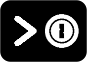

# OPass - Improved 1Password CLI for unix/pass lovers.

If you are a 1Password user but miss the good ol' `pass`, this is your tool!

OPass mimichs the usability unix password store by grouping and organize 1Password items in pretty printed tree. Its goal is to allow users migrating to 1Password a smooth transition without learning (yet) another tool. 

To keep everything organized, OPass uses the tags defined in the items to as the sections.


> 
Important ⚠️
```
This is a semi-cached tool. All the files are needed are inside $HOME/.opass/

OPass makes a copy of your private key (for quick login) and the item's title and UUID.
If you consider this as sensitive information please do not use this tool.

The sign in is handled direct by the 1Password CLI and your data is fetched
from the server and displayed directly in the terminal. 

This projects has not been peer reviewed. Be sure youreviewed the code before using it.

```


## Usage
```
Usage: opass <command>

Flags:
  -h, --help        Show context-sensitive help.
  -c, --copy        Copy password to clipboard.
  -a, --list-all    List all tags and items.

Commands:
  <tag-or-login>
    If a Tag name is given, list all logins under that tag. If an Item name is given, show details.

  list
    List all tags of account.

  config
    Initiate 1Password credentials configuration.

  signin
    Signin to 1Password using predefined credentials.

  flush
    Drop local list of items and sync with 1Password account. Useful after you update information on another device.

Run "opass <command> --help" for more information on a command.
```

## Getting started

#### List all tags
```
$ opass

1Password
└── finance
└── social
└── tech
└── untagged
```

#### List logins of a tag 
```
$ opass tech

1 Password
└── tech
    └── github
    └── gitlab
    └── vpn
```

#### Copy password to clipboard 
```
$ opass -c tech/vpn
Password copied to clipboard.
```

#### Get logins details 
```
$ opass tech/vpn

username: giovane
password: <password>
url: server.vpn.com
updatedat: 2021-03-08T14:15:51Z
itemversion: 2
tags:
- tech

```

## Installing

1. Install the [1Password CLI](https://app-updates.agilebits.com/product_history/CLI)

2. Clone repo and compile
```
$ git clone git@github.com:giovaneliberato/opass.git
$ cd opass
$ make install
```
3. Setup account
```
$ opass config
Sign in Address: https://my.1password.com
Email Address: me@example.com
Private Key: <PRIVATE_KEY>
Configuration file created at $HOME/.opass/config
```

4. Enable autocompletion
```
$ source opass-completion.bash
```

5. **You are good to go! Try running `opass -a`**
